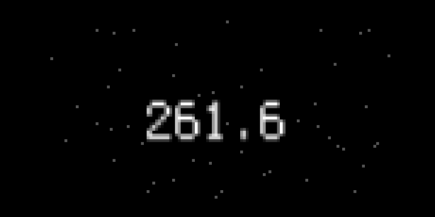
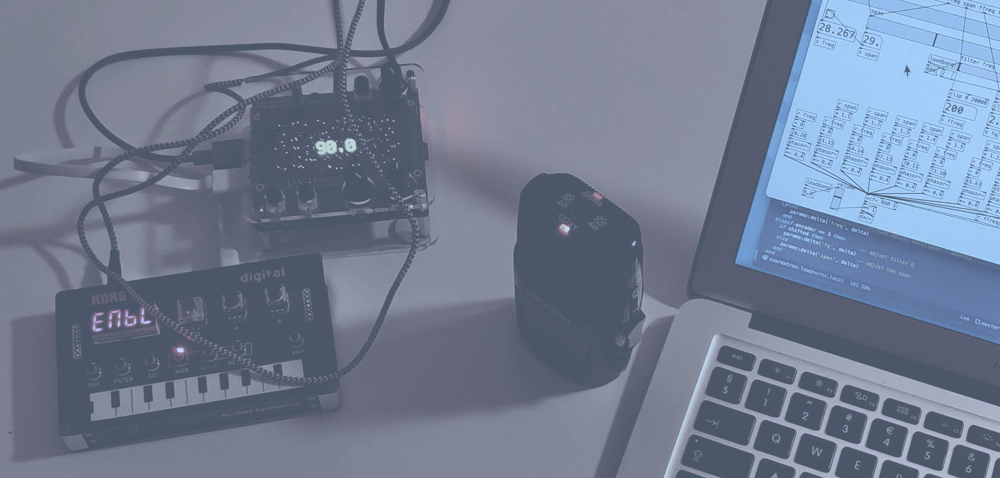
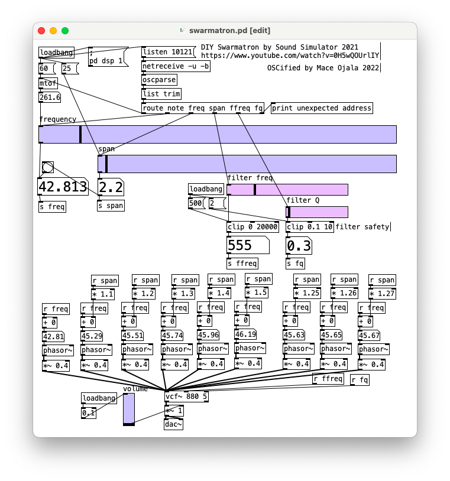

# Swarmatron

Swarmatron for norns, using Pd.

This is basically a Swarmatron from (wunderbar) [Sound Simulator's *DIY Swarmatron (Pure Data & Arduino Tutorial)* video]( https://www.youtube.com/watch?v=0H5wQOUrlIY), for norns.

This is an experimental norns script. So what's the experiment? Using Pure Data (Pd) rather than SuperCollider as engine; a proof-of-concept using OSC to communicate from Lua to OSC to a headless Pd which is started on demand (haha see below).

Pd is a required install for this to work, install with `apt install puredata`. Also this sometimes leaves norns in a confused state, hanging on script load. This has to do with state management of running Pd processes, and maybe it freaks out Jack it if's killed – I'm not sure. Rebooting norns always helps. I hope you enjoy it.

The Pd patch `swarmatron.pd` works the same if you open it in normal desktop Pd.

